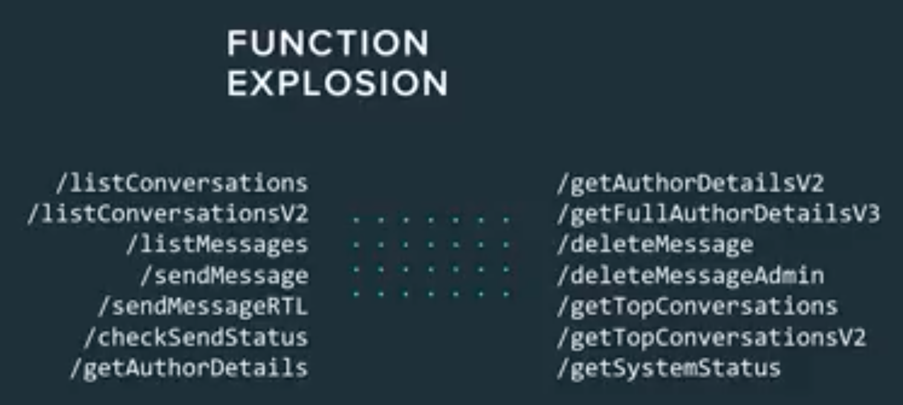

## 写在前面
最近2周的时间由于工作不忙，一直在看有关``GraphQL``的东西，前后端均有涉及，由于我之前做过后端开发，当时实现的接口的大体是符合``RPC``风格的接口。后来转做了前端开发，从实现接口者变成了调用接口者，接触最多的当属``REST``风格的接口。因此在这段学习``GraphQL``的过程中，并且也尝试使用它以全栈的角度做了一个小项目，在这个过程中，一直在思考它对比前两者在``API``设计的整体架构体系中的各个指标上，孰优孰劣。

其实在使用和学习的过程中，有很多文章都对比过它们的异同，但是大部分文章并没有从一个相对客观的角度来对比，更多是为了突显一个的优点而刻意指出另外一个的缺点。这让我想到一句话，脱离业务情景谈技术就是耍流氓。

昨天订阅的``GraphQL Weekly``中推送的一个视频正好是讲关于它们这三者的，于是就点进去看了看，发现质量还是不错的，于是就想整理出来，分享给大家。

原视频地址(油管地址，自备梯子)：[这里](https://www.youtube.com/watch?v=IvsANO0qZEg)

如果没有梯子的话直接看我整理的东西也可以，我觉的应该都覆盖到视频中所讲的重点内容了。

当然，这些内容如果分开来讲，每一块内容所涉及的东西都够写一本书了，这里仅仅是简单归纳和整理，从宏观的角度来对比它们的异同，从而能够在日后面临技术选型时，有一个更佳明确的决策方向。

## RPC 
先简单介绍下``RPC``，它是``Remote Procedure Call(远程过程调用)``的简称。一般基于``RPC``协议所设计的接口，是基于网络采用客户端/服务端的模式完成调用接口的。

### 优点
* 简单并且易于理解（面向开发者）
* 轻量级的数据载体
* 高性能

### 缺点
* 对于系统本身耦合性高
* 因为RPC本身很简单、轻量，因此很容易造成 ``function explosion``

关于``RPC``的优点其实很好理解，就是因为它性能高同时又很简单，但是我认为这是对于接口提供者来讲的（因为它的高耦合性）。

但是如果从接口调用者的角度来看，高耦合性就变成了缺点，因为高耦合意味着调用者必须要足够了解系统本身的实现才能够完成调用，比如：

* 调用者需要知道所调用接口的函数名、参数格式、参数顺序、参数名称等等
* 如果接口提供者(server)要对接口做出一些改变，很容易对接口调用者(client)造成``breaking change``（违背开闭原则)
* 一般``RPC``所暴露接口仅仅会暴露函数的名称和参数等信息，对于函数之间的调用关系无法提供，这意味着调用者必须足够了解系统，从能够知道如何正确的调用这些接口，但是对于接口调用者往往不需要了解过多系统内部实现细节

关于上面的第二点，为了减少``breaking change``，我之前实现接口的时候一般都会引入版本的概念，就是在暴露接口的方法名中加入版本号，一开始效果确实不错，但是随后就不知不觉的形成了``function explosion``，和视频中主讲人所举例的例子差不多，贴一下视频中的截图感受一波：

# REST
当前REST风格的API架构方式已经成了主流解决方案了，相比较RPC，它的主要不同之处在于，它所对于资源(Resource)的模型化而非步骤(Procedure)。

### 优点
* 对于系统本身耦合性低，调用者不再需要了解接口内部处理和实现细节
* 重复使用了一些 http 协议中的已定义好的部分状态动词，增强语义表现力
* API可以随着时间而不断演进

### 缺点
* 缺少约束，缺少简单、统一的规范
* 有时候 payload 会变的冗余(overload)，有时候调用api会比较繁琐(chattiness) 
* 有时候需要发送多条请求已获取数据，在网络带宽较低的场景，往往会造成不好的影响

REST的优点基本解决了RPC中存在的问题，就是解耦，从而使得前后端分离成为可能。接口提供者在修改接口时，不容易造成breaking-change，接口调用者在调用接口时，往往面向数据模型编程，而省去了了解接口本身的时间成本。

但是，我认为REST当前最大的问题在于虽然它利用``http``的动词约束了接口的暴露方式，同时增强了语义，但是却没有约束接口如何返回数据的最佳实践，总让人感觉只要是返回json格式的接口都可以称作REST。

我在实际工作中，经常会遇到第二条缺点所指出的问题，就是接口返回的数据冗余度很高，但是却缺少我真正需要的数据，因此不得已只能调用其他接口或者直接和后端商议修改接口，并且这种问题会在web端和移动端共用一套接口中被放大。

当前比较好的解决方案就是规范化返回数据的格式，比如json-schema或者自己制定的规范。

# GraphQL
GraphQL是近来比较热门的一个技术话题，相比REST和RPC，它汲取了两者的优点，即不面向资源，也不面向过程，而是面向数据查询(ask for exactly what you want)。

同时GraphQL本身需要使用强类型的Schema来对数据模型进行定义，因此相比REST它的约束性更强。

### 优点
* 网络开销低，可以在单一请求中获取REST中使用多条请求获取的资源
* 强类型Schema（约束意味着可以根据规范形成文档、IDE、错误提示等生态工具）
* 特别适合*图*状数据结构的业务场景（比如好友、流程、组织架构等系统）

### 缺点
* 本身的语法相比较REST和RPC均复杂一些
* 实现方面需要配套 Caching 以解决性能瓶颈
* 对于 API 的版本控制当前没有完善解决方案（社区的建议是不要使API版本化）
* 仍然是新鲜事物，很多技术细节仍然处于待验证状态

鉴于GraphQL这两个星期我也仅仅是做了一些简单地使用和了解，仅仅说一下感受。

首先值得肯定的是，在某些程度上确实解决了REST的缺点所带来的问题，同时配套社区建议的各种工具和库，相比使用REST风格，全栈开发体验上升一个台阶。

但是这个看起来很好的东西为什么没有火起来呢？我觉的最主要的原因是因为GraphQL所带来的好处，大部分是对于接口调用者而言的，但是实现这部分的工作却需要接口提供者来完成。

同时GraphQL的最佳实践场景应当是类似像Facebook这样的网站，业务逻辑模型是图状数据结构，比如社交。如果在一些业务逻辑模型相对简单的场景，使用GraphQL确实不如使用REST来得简单明了、直截了当。

另外一方面是GraphQL的使用场景相当灵活，在我自己的调研项目中，我是把它当做一个类似ORM的框架来使用的，在别人的一些文章中，会把它当做一个中间层来做渐进式开发和系统升级。这应当算是另外一个优点。

### 到底用哪个
下面根据要设计的API类型给予一些技术选型建议。

如果是``Management API``，这类API的特点如下：
 
* 关注于对象与资源
* 会有多种不同的客户端
* 需要良好的可发现性和文档

这种情景使用``REST + JSON API``可能会更好。

如果是``Command or Action API``，这类API的特点如下：
 
* 面向动作或者指令
* 仅需要简单的交互

这种情况使用``RPC``就足够了。

如果是``Internal Micro Services API``，这类API的特点如下：

* 消息密集型
* 对系统性能有较高要求

这种情景仍然建议使用``RPC``。

如果是``Micro Services API``，这类API的特点如下：

* 消息密集型
* 期望系统开销较低

这种情景使用``RPC``或者``REST``均可。

如果是``Data or Mobile API``，这类API的特点是：

* 数据类型是具有图状的特点
* 希望对于高延迟场景可以有更好的优化

这种场景无疑``GraphQL``是最好的选择。

### 写在最后
提供一张表格来总览它们之间在不同指标下的表现：

|                | 耦合性 | 约束性 | 复杂度 | 缓存   | 可发现性 | 版本控制 |
| -------------- | :----: | :----: | :----: | :----: | :------: | :------: |
| RPC(Function)  | high   | medium | low    | custom | bad      | hard     |
| REST(Resource) | low    | low    | low    | http   | good     | easy     |
| GraphQL(Query) | medium | high   | medium | custom | good     | ???      |

最后引用人月神话中的观点``no silver bullet``，在技术选型时需要具体情况具体分析，不过鉴于GraphQL的灵活性，把它与RPC和REST配置使用，也是不错的选择。